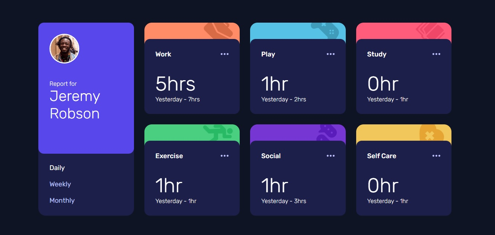

# Frontend Mentor - Time tracking dashboard solution

This is a solution to the [Time tracking dashboard challenge on Frontend Mentor](https://www.frontendmentor.io/challenges/time-tracking-dashboard-UIQ7167Jw). Frontend Mentor challenges help you improve your coding skills by building realistic projects.

## Table of contents

- [Overview](#overview)
  - [The challenge](#the-challenge)
  - [Screenshot](#screenshot)
  - [Links](#links)
- [My process](#my-process)
  - [Built with](#built-with)
  - [What I learned](#what-i-learned)
  - [Continued development](#continued-development)
- [Author](#author)

## Overview

### The challenge

Users should be able to:

- View the optimal layout for the site depending on their device's screen size
- See hover states for all interactive elements on the page
- Switch between viewing Daily, Weekly, and Monthly stats

### Screenshot

### Links

- Solution URL: [https://github.com/wavegate/time-tracking-dashboard-main](https://github.com/wavegate/time-tracking-dashboard-main)
- Live Site URL: [https://sparkly-chimera-1420e7.netlify.app/](https://sparkly-chimera-1420e7.netlify.app/)

## My process

### Built with

- Semantic HTML5 markup
- CSS custom properties
- Grid and Flexbox
- JavaScript w/ Fetch API

### What I learned

- First time using Grid
- Using Fetch to load a local .json file

### Continued development

- The script file didn't take long to write but it looks quite messy. I imagine once I get into more complicated states and hooks, etc. I will want to learn React.

## Author

- Website - [wavegate](https://github.com/wavegate)
- Frontend Mentor - [@wavegate](https://www.frontendmentor.io/profile/wavegate)
